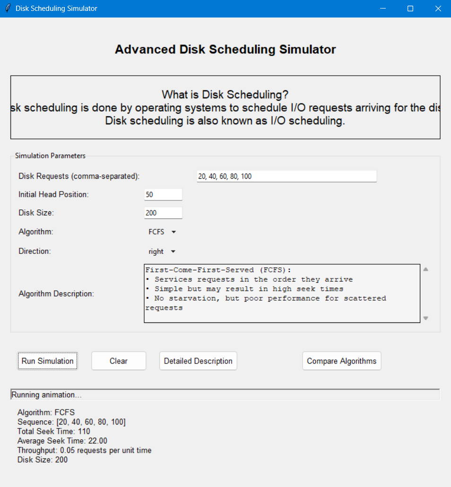
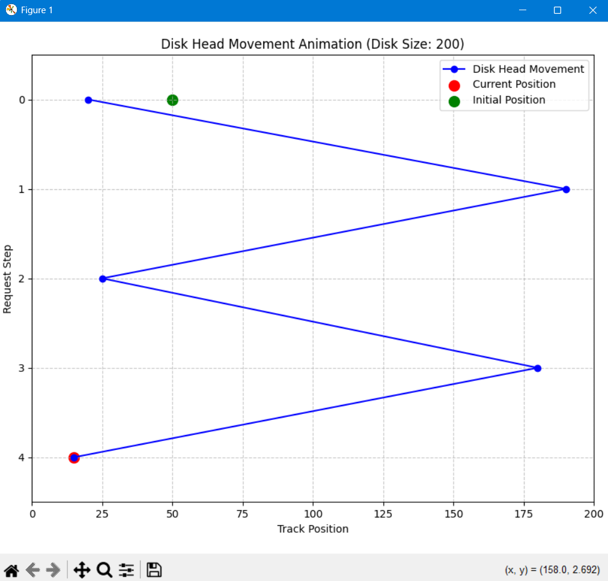
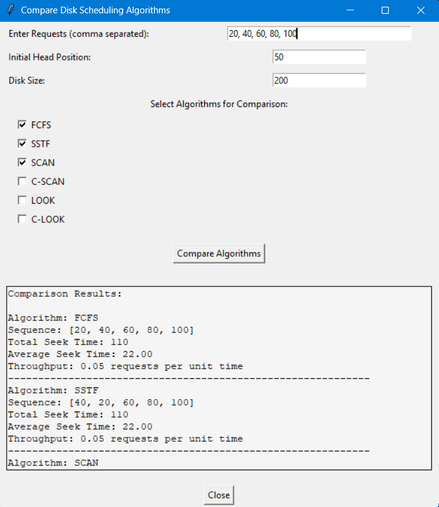

# 🖥️ Advanced Disk Scheduling Simulator

A Python-based **Disk Scheduling Simulator** with a GUI built using **Tkinter**. 
The simulator allows users to visualize different disk scheduling algorithms, compare their performance, and see animated head movements using **Matplotlib**.

---

## 🚀 Features
✅ Supports multiple disk scheduling algorithms:
   - **FCFS** (First Come First Serve)
   - **SSTF** (Shortest Seek Time First)
   - **SCAN** (Elevator Algorithm)
   - **C-SCAN** (Circular SCAN)
   - **LOOK**
   - **C-LOOK**

✅ **Graphical Visualization** of disk head movement  
✅ **Algorithm Comparison Mode** (Run multiple algorithms and compare results)  
✅ **Performance Metrics** (Seek Time, Throughput, Disk Size)  
✅ **Animation** of disk head movement using **Matplotlib**  
✅ **User-Friendly GUI** with input validation and real-time updates  

---

## 📦 Installation
### 1️⃣ Clone the Repository
```bash
git clone https://github.com/AlwinW64/Advanced_Disk_Scheduling_Simulator.git
cd Advanced_Disk_Scheduling_Simulator

2️⃣ Install Dependencies
Make sure you have Python installed (preferably Python 3.7+). Install the required libraries:

pip install matplotlib numpy tkinter


🎮 Usage
Run the simulator using:

python main.py


💡 How to Use

- Enter disk requests (comma-separated values).
- Set the initial head position and disk size.
- Select one or more scheduling algorithms for comparison.
- Click "Compare Algorithms" to view results in text format and visualization.
- Click "Run Animation" to see the head movement.


📸 Screenshots

Main Window:



Graph:


Algorithm Comparison:



🛠️ Project Structure

disk-scheduling-simulator/
│── main.py               # Main GUI Application
│── algorithms.py         # Disk Scheduling Algorithms
│── visualization.py      # Graph Plotting & Animations
│── README.md             # Project Documentation
│── requirements.txt      # Dependencies
│── screenshots/          # Images for README


🤝 Contributing

Fork the repository
Create a new branch:
git commit -m "Added feature XYZ"
Push to your fork and submit a Pull Request.


📜 License

This project is licensed under the MIT License.


👨‍💻 Author

Developed by:
Alwin, Vinayak and Subrat 🎯

For any queries, feel free to reach out!


⭐ Support

If you like this project, don't forget to ⭐ the repository!

xoxo
